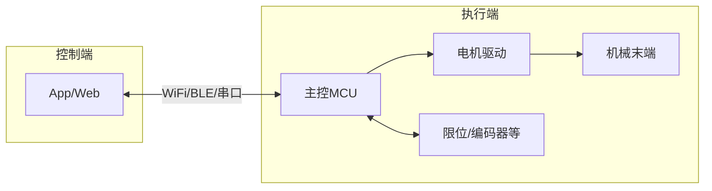

# AutoMaster 系统总览与需求

## 1. 项目名称与定位

**AutoMaster** 是一套软硬件一体化的自动拍打设备系统，核心产物包括：

- **硬件**：便携、可简易安装的自动拍打机（机械 + 电气 + 固件）
- **软件**：配套控制端（手机 App 或网页），用于参数设置与运行控制

目标用户为需要背部或身体局部拍打放松、理疗的家庭或个人用户，设备布置于人体一侧，通过末端工具模拟人手用力挥动拍击，并可自动覆盖设定范围。

---

## 2. 典型使用场景

- **场景描述**：用户平趴在床上，设备布置于人体一侧（如床边或地面）。末端工具（柳条或木板等）的长端垂直于人体，设备挥动臂做“挥下—抬起”往复运动，使工具拍击用户后背，随后向上复位，进行下一次拍击。
- **覆盖需求**：为照顾整个背部及左右侧背，设备需具备一定程度的**自动左右移动**和**远近移动**能力，使拍击位置可编程或可调，覆盖整个背部范围。
- **体验需求**：拍击力度 ≥ 普通成年人用力挥动末端工具的效果，且力度、拍击频率、拍击位置范围均可调；末端工具拍击时尽量平直接触人体，避免单纯旋转导致的远端重、近端轻的不均匀感。

---

## 3. 功能清单

| 类别 | 功能 | 说明 |
|------|------|------|
| 运动 | 挥动 + 向上复位 | 末端做“挥下拍击 → 向上复位”往复，非 360° 旋转；最高约 1 次/秒 |
| 运动 | 左右移动 | 沿人体左右方向移动，扩大横向覆盖范围 |
| 运动 | 远近移动 | 沿人体头脚方向或设备径向移动，扩大纵向/深度覆盖 |
| 参数 | 力度可调 | 不低于成人用力挥动，多档或连续可调 |
| 参数 | 频率可调 | 拍击频率可调（如 0.2–1 Hz） |
| 参数 | 拍击范围可调 | 左右、远近的行程或区域可设 |
| 机械 | 末端平直拍打 | 通过机械设计（如末端带阻尼关节）使工具相对平直拍打在人体上 |
| 软件 | 控制端 | 手机 App 或网页：设置力度、频率、范围等，启停、急停、状态显示 |

---

## 4. 非功能需求与设计优先级

- **便携优先**：设备相对于人后背的位置可通过安装位置灵活调整，因此**不针对固定安装位置做约束**，机械与电气设计**优先考虑便携与可拆装**。底座可采用吸盘式立式机构，便于快速固定于地面或光滑台面并竖直布置。
- **简易安装**：可固定于地面、床边或桌面等，安装步骤简单、无需专业工具为佳；吸盘底座可进一步简化安装。
- **安全**：具备急停手段；各轴限位，避免机械超程；软件与固件侧对最大力度、最大速度进行限制，防止误操作或故障时伤人。
- **可维护性**：机械与电气模块划分清晰，便于后续更换电机、传动件或末端工具。

---

## 5. 系统框图

- **控制端**：手机 App 或网页，用户设置参数（力度、频率、范围等）并发送指令（开始、暂停、急停等）；接收执行端状态（运行中、错误、限位等）。
- **执行端**：主控 MCU 接收指令、解析参数，驱动电机（挥动轴、左右轴、远近轴），并读取限位开关、可选编码器或电流反馈；机械末端完成挥动与复位、左右/远近移动及末端夹持与拍击。

文档索引：机械方案见 [02-mechanical.md](02-mechanical.md)，电机选型见 [03-motor-selection.md](03-motor-selection.md)，电气与通信见 [04-electrical.md](04-electrical.md)，软件架构见 [05-software.md](05-software.md)。
